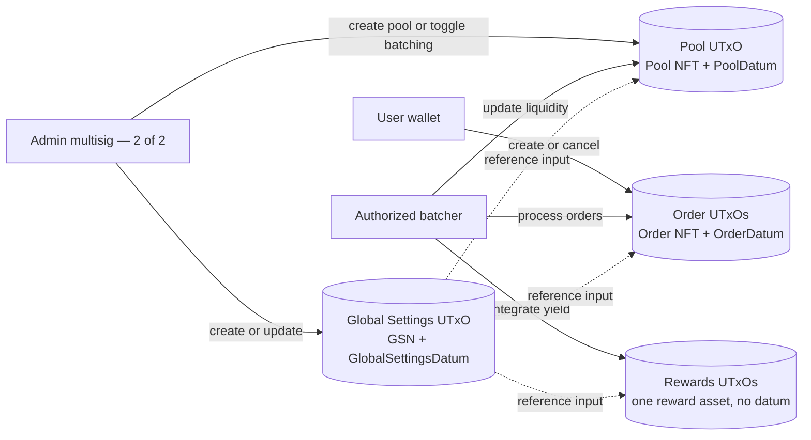
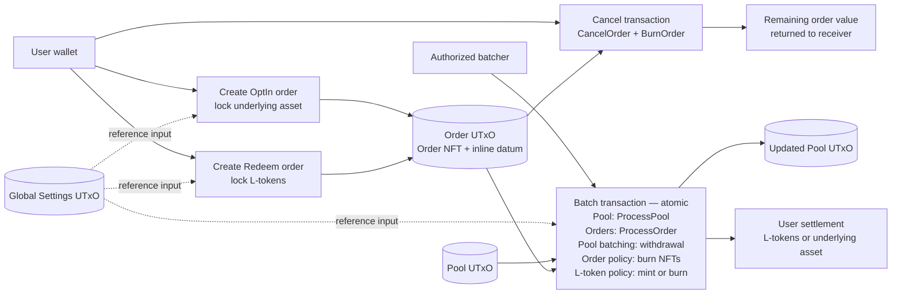
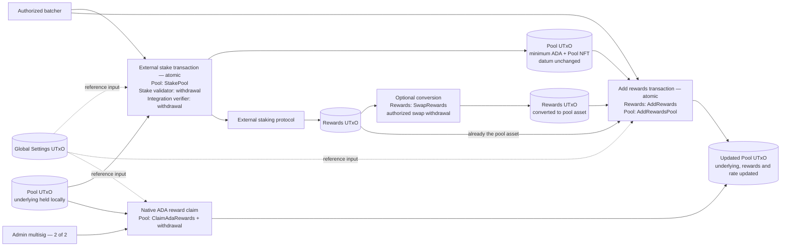

# Lava protocol flow

## State and authority

`globalSettingsSeed` fixes the Global Settings script hash. That hash feeds every
downstream validator. `poolReference` and `batchingReference` are storage UTxOs
for reference scripts; they are not protocol state.

## Order lifecycle

The exchange rate uses a precision factor of `100000`:

- Opt-in: `L-token amount = deposit × 100000 / exchange rate`
- Redeem: `underlying amount = L-token amount × exchange rate / 100000`

The frontend action labelled **Unstake** creates a `Redeem` order. It is not an
external-staking withdrawal.

## External yield and rewards

External exit is integration-specific. The current concrete E2E path uses
Atrium; Minswap and the other stake datum validators are adapters around the
same pool and rewards state.

## Validator ownership

| Validator | Responsibility |
| --- | --- |
| `global_settings` | Bootstrap and update the singleton configuration UTxO |
| `pool_validator` | Create pool NFTs and guard pool state transitions |
| `order_validator` | Create, cancel and process user orders |
| `pool_batching` | Check batcher authority, order math and the resulting pool state |
| `minting` | Permit L-token mint or burn only during a valid batch |
| `stake_validator` | Move pool-held underlying into the selected external strategy |
| `rewards_validator` | Convert or reintegrate strategy rewards |
| `stake_datums/*` | Enforce integration-specific deposit rules |
| `swap_validators/*` | Enforce integration-specific reward conversion rules |

## Deployment note

`smart_contract/plutus.json` and the current E2E datum builders use the older
compiled schema. The current Aiken source has since moved
`rewards_validator_hash` from `GlobalSettingsDatum` into each `StakeType`.
Running `aiken build` will change the schema and validator hashes, so the E2E
datum builders must be updated before deploying a freshly rebuilt blueprint.

The current fresh-bootstrap path also needs adjustment: Global Settings creation
asks for a pool-specific rewards validator before that pool exists.
